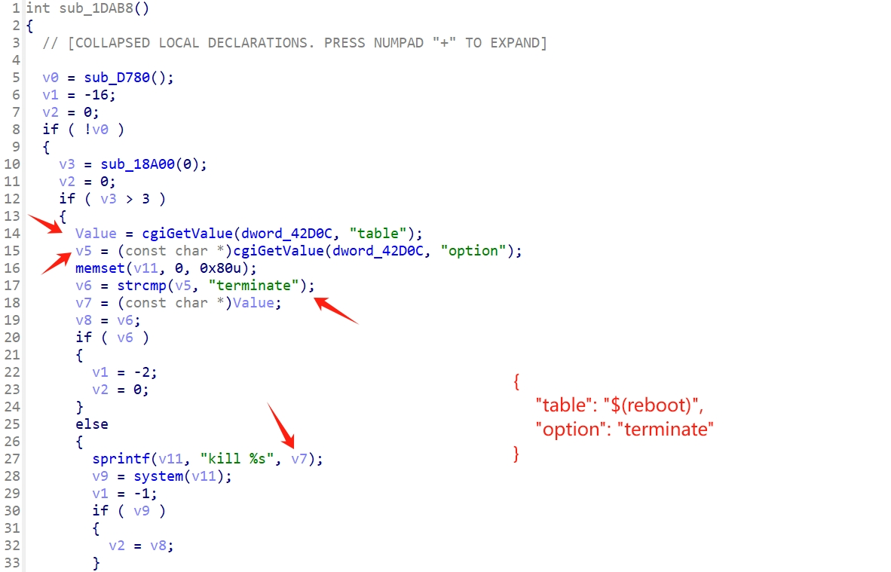
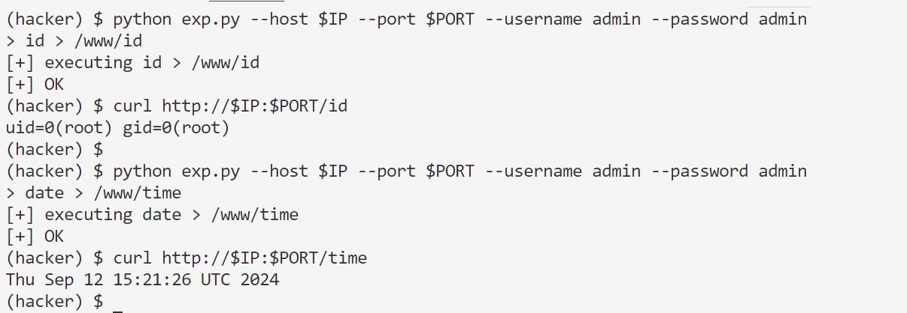

### TL;DR

Vendor: Vigor2960

Firmware: v1.4.4

An authorized RCE vulnerability exists in the Vigor2960 router, where an attacker can place a malicious command into the `table` parameter of the `doPPPoE` function in the `cgi-bin/mainfunction.cgi` route, and finally the command is executed by the `system` function in the command splice string.

### Analysis

The vulnerability occurs in `/www/cgi-bin/mainfunction.cgi` in the Vigor2960 router filesystem, and if you want to reproduce it you can download [firmware](https://www.draytek.co.uk/support/downloads/vigor-2960/older-firmware/firmware-144) here , and of course I've dumped the [file](./cgi-bin/mainfunction.cgi) to this repo.

In the `doPPPoE` function of the `cgi-bin/mainfunction.cgi` route in the management interface of this router, it accepts a `table` parameter and an `option` parameter. When the option is "terminate", the table parameter will be formated into `kill %s` and the `system` is used to execute the command.




### Expolit

```
$ python exp.py \
    --host $IP \
    --port $PORT \
    --username $USERNAME \
    --password $PASSWORD
```
